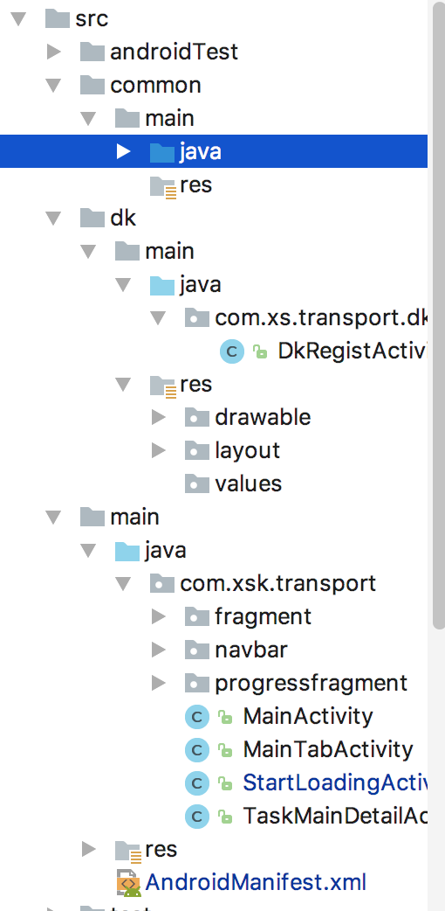
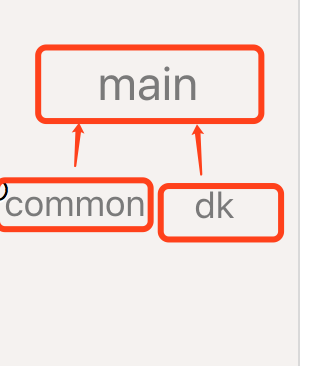

利用Android Studio进行代码模块隔离
AS 是个非常神奇的Android编辑器，尤其是使用gradle更是花样百出
今天就是用gradle进行业务逻辑模块进行划分隔离
#1 sourceSets
## 通过使用sourceSets进行文件包的划分
```
	 sourceSets {
        def dirs = ["", "common", "dk"]
        main {
            manifest.srcFile 'src/main/AndroidManifest.xml'

            dirs.each { dir ->
                if (dir.isEmpty()) {
                    java.srcDir("src/main/java")
                    res.srcDir("src/main/res")
                } else {
                    java.srcDir("src/${dir}/main/java")
                    res.srcDir("src/${dir}/main/res")
                }
            }
        }
    }
   
	
```
###我们将代码才分为默认的 common 和 dk三个部分，其中common 和 dk 依赖于 main工程，manifest文件共用，而其子模块则具有自己的完全独立特性，十分灵活
##2 优势 不足
### 优势

1.	结构拆分灵活，可以随时根据项目需要进行拆分配置
2. 对比于library aar等调试更加方便
3. 在一定程度上方便类业务以及模块的划分
4. 对比于原有的方便进行测试

### 不足
1.	代码没有做到完全的隔离，子模块会侵入到主模块
2. 模块的结构完全依赖于本地的拆分，不能够做到通用
3. 对于多人合作多有不便

##3最终文件结构图
 
##4结构依赖关系

